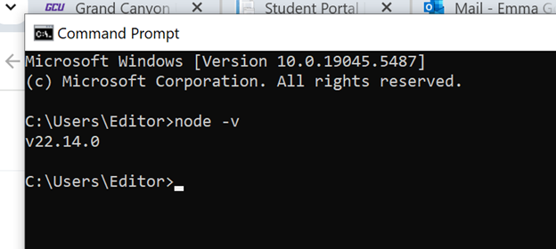
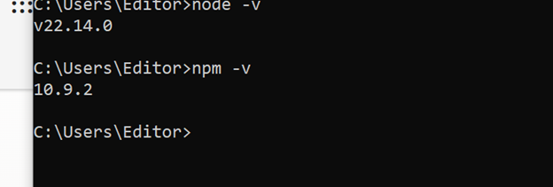
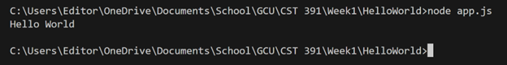
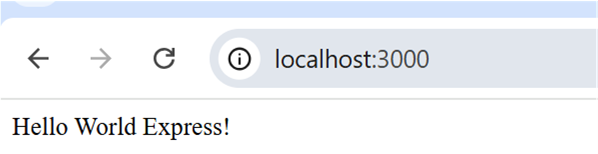
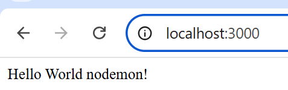
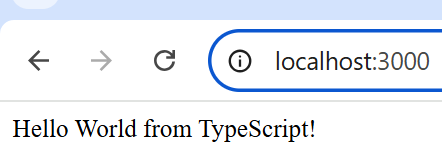
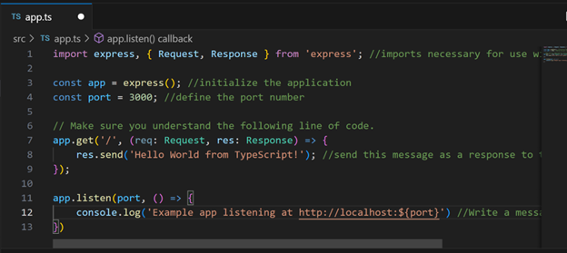

# Activity 0

- Author: Emma Gostling
- Date: March 7, 2025

## Introduction

- In this activity we will be installing Node.js and creating the following programs:
     - Command Line Hello World application
     - Browser Hello World application using Express
     - Browser application using Typescript

## Screenshots

#### Part 1
 

Screenshot 1: Results of the node -v command, showing the current version of Node.js

 
Screenshot 2: Results of the npm -v command, showing the current version of npm

 
Screenshot 3: Results of running node app.js in the VS Code terminal

 
Screenshot 4: Hello World Express page displaying in the browser.

 
Screenshot 5: Hello World page displaying updated content after refreshing

#### Part 2:
 

Screenshot 6: Typescript application running in the browser

 
Screenshot 7: Commented typescript code

## Conclusion

In this activity, we installed Node.js and created several Hello World applications using various technologies such as Express and TypeScript. We learned about nodemon, which automatically updates whenever a new change is made on the server. This allows you to simply refresh the page to see the new content, rather than having to manually restart the program in order to put updated code into action. We also learned about routing and how to define various endpoints that you can access via HTTP requests.