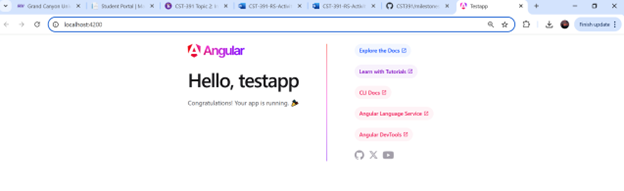

# Activity 2

- Author:  Emma Gostling
- Date:  15 March 2025

## Introduction

In this activity we will install [Angular](https://angular.dev/) and create a starter application to explore the basics of how an Angular application works and some of the key files and directories. 

## Activity 2 Commands

- Install Angular

```
npm install -g @angular/cli
```

- Check the current version of Angular on your machine

```
ng version
```

- Create a new Angular project, testapp

```
ng new testapp
```

- Change directory to the new project

```
cd testapp
```

start the server

```
ng serve
```

## Screenshots


Screenshot 1: Results of running "ng version", which displays the curent version of Angular running on your machine.


Screenshot 2: The default page for the newly created "testapp" application.


Screenshot 3: CLI confirmation that the new changes triggered an automatic page reload.


Screenshot 4: The new updates are now displaying in the browser (added "XXX" to the application title).


Screenshot 5: A new h3 element is displayed below the title using a newly added variable "name".

## Research
A: 

Folders:
-	Node_modules: This is where any external dependencies listed in the package.json file are stored.
-	Src: This is where all of the source files for the application are contained.
-	Src/app: This subfolder within the “src” directory is the core of the application, containing modules, components and services.
-	Src/assets: This is where you would store things such as images that are used within the application.
-	Src/environments: Contains the configuration files for the current environment (production, development, etc.)

Files:
-	Angular.json: This file provides the configuration settings for the application, including build, server and testing.
-	Package.json: This is where you would define your dependencies, among other things (project name, version, scripts, etc).
-	Tsconfig.json: Specifies the configuration settings for the TypeScript and Angular compilers.

B:
-	Main.ts: This is the starting point for the application.
-	App.component.css: Defines the styles that are applied to the root component of the application. 
-	App.component.html: Defines the presentation of the root component (the main layout of the application)
-	App.component.ts: Defines the root component, specifying properties and methods associated with it, as well as the files that it should use for layout (App.component.html) and styling (App.component.css)
-	App.module.ts: Configures the components, services and dependencies of the application.

## Test Links

- http://localhost:4200


## Conclusion

- In this activity , we created a basic Angular application and experimented with adding changing and adding variables to see how they displayed on the page and learn the mechanics of how an Angular application works.