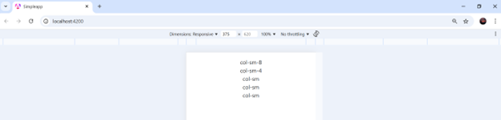
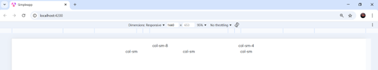
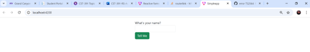
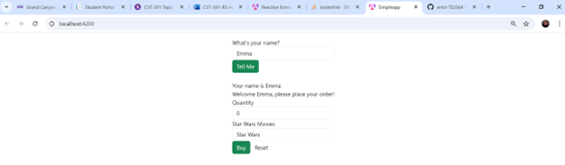
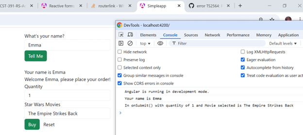
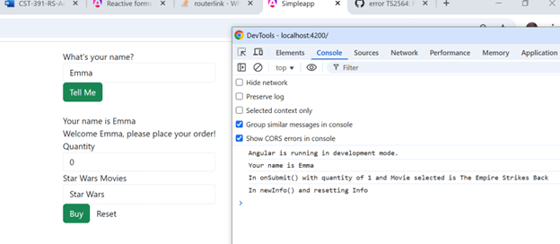
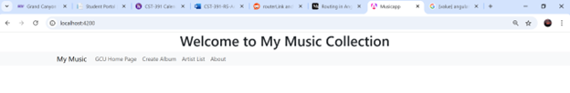
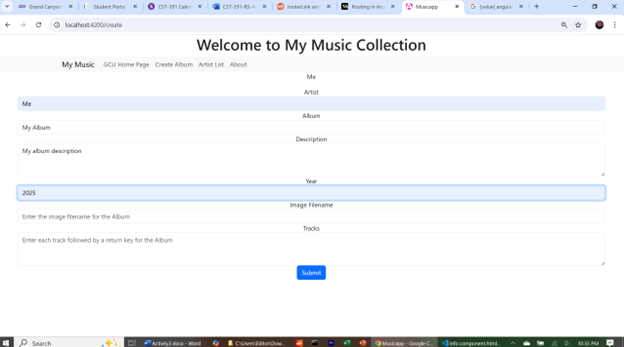
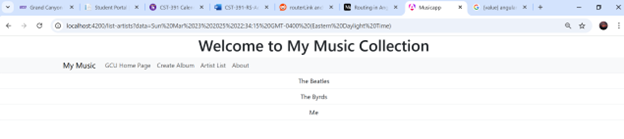
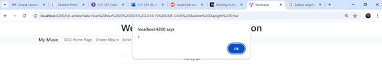

# Activity 3

- Author:  Emma Gostling
- Date:  23 March 2025

## Introduction

- In this activity, we learn the basics of creating an Angular application, defining routes, creating components and services, and binding data between various classes.

## Activity 2 Commands

- Create a new angular application

```
ng new app
```
- Install Boostrap

```
npm install bootstrap
```

- Install Popper

```
npm install @popperjs/core
```

- Start the server

```
ng serve
```

- Create a new component

```
ng generate component example
```

- Create a new service

```
ng generate service example
```

# Part 1

## Screenshots


<br />
Screenshot 1a: Table display on a small screen


<br />
Screenshot 1a: Table display on a large screen


<br />
Screenshot 2a: The initial state of the application prior to entering a name


<br />
Screenshot 2b: Additional page content displaying after entering a name


<br />
Screenshot 3a: DevTools result after clicking the "Buy" button


<br />
Screenshot 3b: DevTools result after clicking the "Reset" button

## Research

```@Input```: The @Input decorator allows you to pass data between a child class and a parent class. A field decorated with @Input receives its data from the parent class and is automatically updated when the value in its parent class changes.

```[value]```: Using square brackets around an element property allows for one-way binding. This means that the value of this property is updated when the data in the component changes.

```[(ngModel)]```: This notation allows for two-way binding, meaning that in addition to changes in the component data updating the element property, it can also go the other way, where changes to an input field update the value in the component.


# Part 2

## Screenshots


<br />
Screenshot 1: Initial page for the application


<br />
Screenshot 2: Result after clicking on the "GCU Home Page" tab in the nav bar


<br />
Screenshot 3: Create Album page showing a new album currently being entered


<br />
Screenshot 4: A list of all artists, including the artist of the new album created in the previous screenshot


<br />
Screenshot 5: Alert box showing the value of property "version" 

## Research

Link to 
[Commented Service Code](https://github.com/EmmaGCU/CST391/blob/main/Week3/musicapp/musicapp/src/app/service/music-service.service.ts)

# Conclusion

- In this activity we created a simple application and explored how to create new components. We also explored databinding through ```[value]``` and ```[(ngModel)]```, as well as learning about the ```@Input``` decorator which is used to pass data from a parent class to a child class. In Part 2, we created another application, and used routerLink to route to various parts of the application. We implemented various modules including create and list.
