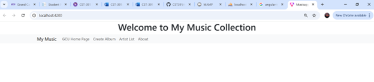
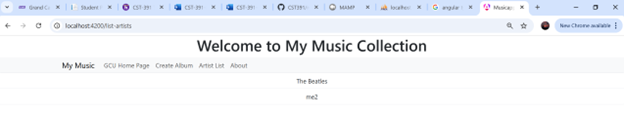
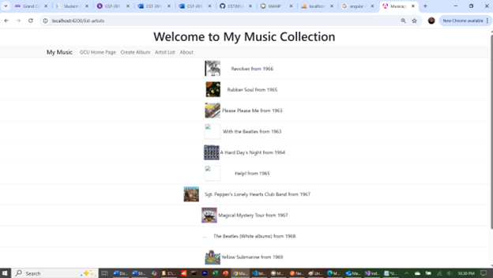
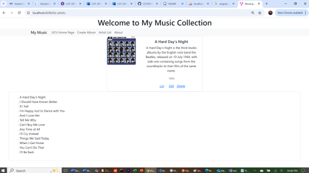
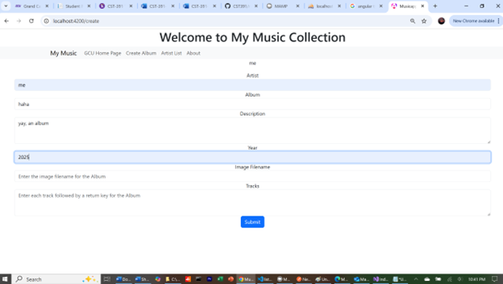

# Activity 4

- Author:  Emma Gostling
- Date:  30 March 2025

## Introduction

- In this activity, we will replace the hardcoded data and instead integrate the application with the database and API endpoints defined previously.

## Activity 4 Commands

```
npm install
npm install -g @angular/cli --latest
npm install jquery --save-dev
npm install bootstrap
npm install @popperjs/core
ng version
ng serve
```

## Screenshots



Screenshot 1: Main Screen of the application.



Screenshot 2: Artist List page, showing all artists currently in the database.



Screenshot 3: List of albums displaying based on the selected artist



Screenshot 4: A detailed view of the selected album, including the tracks associated with the album



Screenshot 5: Create Album page, adding a new album to the database

## Research

Angular typically maintains a logged-in state via the use of JWT's (Json Web Tokens) or other authenticiation data, which it stores in the browser. The application then sends this information in an Authorization header along with the request. This is then validated by the server in order to grant access to prtected resources.

## Conclusion

- In this activity, we replaced the hardcoded data that we used originally, and instead integrated our application with the API that we defined in a previous activity in order to communicate with the database. We also learned how to use callback functions, which execute after the completion of the main task within the method that it was passed into.