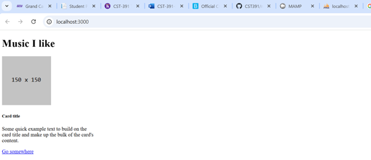
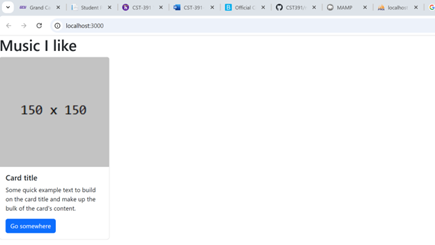
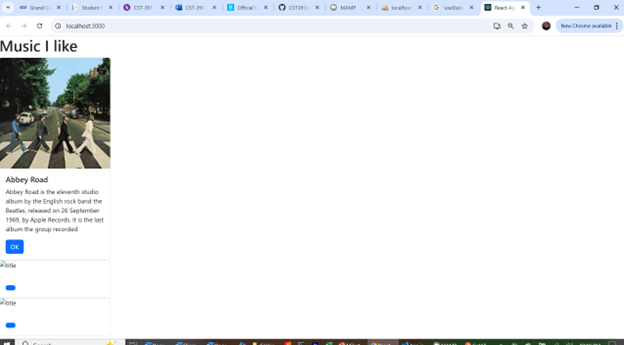
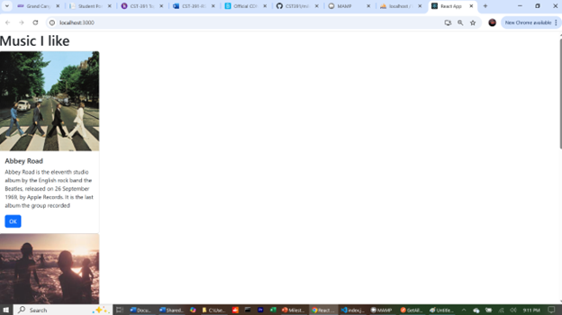
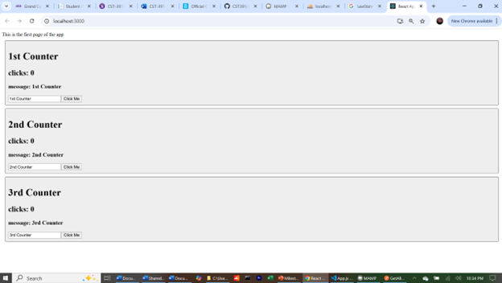
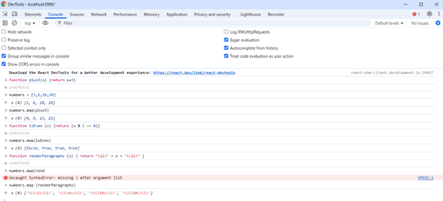
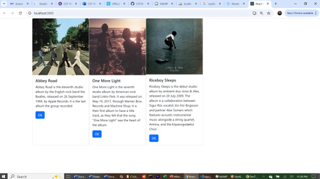
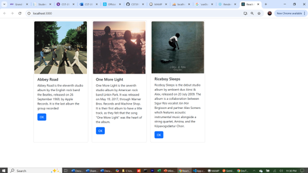

# Activity 4

- Author:  Emma Gostling
- Date:  6 April 2025

## Introduction

- In this activity we will learn some of the basics of programming in React, which is a popular, component based JavaScript framework. We will cover topics including JSX syntax, components, map functions, and props vs state.

## Activity 4 Commands

Create a new react application:
```
npx create-react-app appName
```

## Screenshots
### Part 1:



Screenshot 1: The initial card display prior to applying any CSS.



Screenshot 2: Card after applying CSS.



Screenshot 3: Card with data. The image, title, description and button text are passed in as parameters.



Screenshot 4: Display after data was added for the other two cards.

#### Part 1 Summary:

In this part of the activity, we learned how to create a new React application from the command line. We also learned some of the basics of how some of the files are structured, for example, the inclusion of imports at the beginning of each of the files. We learned some JSX syntax and how to work with components and props.

### Mini App:



Screenshot 1: The initial state of the Counter display prior to clicking or changing anything. Shows the use of props to display a unique title for each counter.


Screenshot 2: Updated counter after clicking the button and editing the message in the 1st Counter. Demonstrates the use of hook to access and update the current state of each individual counter.

#### Mini App Summary:

The part of the activity demonstrated the use of hook, which allow you to access state within an application. We also explored the difference between props and state. (Props are passed in from the parent and tend not to change, while state represents the current state of the component, independent of the parent).

### Part 2:



Screenshot 1: Demonstration of map functions from the browser console.


Screenshot 2: The original display of the cards from the previous section, stacked vertically prior to applying additional CSS to control the layout.



Screenshot 3: Result after applying the ```display: flex``` style. Cards are now listed side by side rather than vertically.



Screenshot 4: Result after adding padding and margin to the applied css. This adds some space between each of the cards.

#### Part 2 Summary:

In this part of the activity, we looked at map functions and how they work, essentially transforming a given set of data based on the rules defined in the function. We also explored some additional CSS options including ```display: flex``` which allowed us to lay out our page in a more appealing way rather than just having everything stacked vertically.

## Conclusion

- In this activity, we learned some of the basics of react programming. Topics included an introduction to what a component is and how to refactor existing code to make it more maintainable by using map functions and smaller components. We also learned about state and props and the difference between the two.