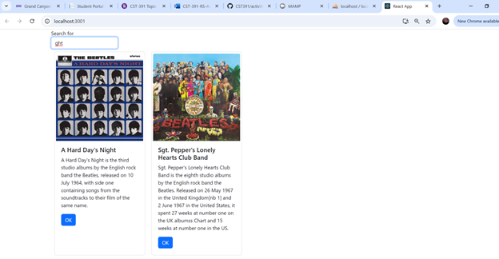

# Activity 6

- Author:  Emma Gostling
- Date:  13 April 2025

## Introduction

- In this activity we will learn about routing and navigation within a React application. We will also remove hard coded data from an application started previously and instead read in the data from a JSON file. Additionally we will learn how to refactor an application into smaller components.

## Activity 6 Commands

Create a new react application:
```
npx create-react-app appName
```

Install the react-router-dom library:
```
npm install react-router-dom --save
```

## Screenshots
### Part 1:


Screenshot 1: Console warning prior to adding a "key" property to the Card component.


Screenshot 2: Placeholder text displaying above the list of albums where the search form will eventually be.


Screenshot 3: Console output after typing some sample text into the search box.


Screenshot 4: Console output displaying the search phrase that was entered (demonstrates that the onSubmit event is being triggered).


Screenshot 5: Albums are now being successfully read from a JSON file rather than hard coded.



Screenshot 6: Albums have successfully been filtered based on the search criteria.

#### Part 1 Summary:

In this part of the activity, we learned how to read in data from a JSON file, and used this technique to remove the hard coded data used originally. We also added some search functionality, allowing users to filter albums based on their description containing a specified search phrase.

### Mini App:


Screenshot 1: The initial landing page for the application.


Screenshot 2: Result after clicking on of the names listed.


Screenshot 3: Attempting to access a secured page prior to login. This is also the case with the 'contact us' page.


Screenshot 4: Accessing the User page.


Screenshot 5: Shows the 'login' page which at the moment is just a button that updates the login status.


Screenshot 6: About page, displaying information about the company.


Screenshot 7: ContactUs page, displaying information on how to contact the company.

#### Mini App Summary:

This part of the activity demonstrated the use of routing in React. We used the ```<Route>``` tag to define the routing for each of the navbar tabs. We also used ```<PrivateRoute>``` to secure some of the tabs, requiring login prior to allowing access.

### Part 2:


Screenshot 1: Application still displaying as it was previously after refactoring to split the code into smaller components.


Screenshot 2: Placeholder text showing where a future 'Add New Album' form will be located.


Screenshot 3: Album Details page, available for each album with places to display tracks, lyrics and videos.

#### Part 2 Summary:

In this part of the activity, we refactored the code to use smaller components such as AlbumList and SearchAlbum. This allows for better maintainability of your code. We also added some routing to the application in order to display the details for the selected album.

## Conclusion

- In this activity, we learned about routing in React. We also did some code refactoring in order to improve maintainability and split some of the components into smaller, more specified pieces. We refreshed ourselves on the difference between props and state, and got some more experience using hooks in order to access and update state.