# Activity 7

- Author:  Emma Gostling
- Date:  20 April 2025

## Introduction

- In this activity we will learn about routing and navigation within a React application. We will also remove hard coded data from an application started previously and instead read in the data from a JSON file. Additionally we will learn how to refactor an application into smaller components.

## Activity 7 Commands

Create a new react application:
```
npx create-react-app appName
```

## Screenshots
### Mini App 3:

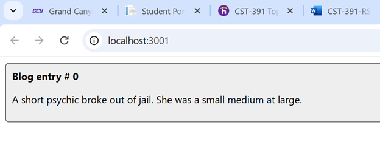

Screenshot 1: The initial hardedcoded post for the blog app.

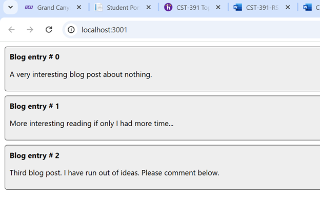

Screenshot 2: Additional hardcoded posts.

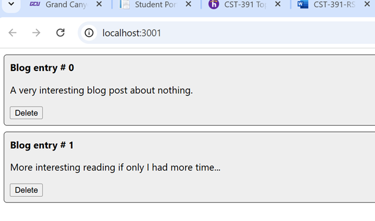

Screenshot 3: Added a delete button to each of the posts. Post # 2 has been removed.

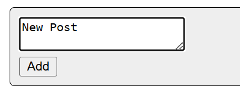

Screenshot 4: Added a form to create a new post.

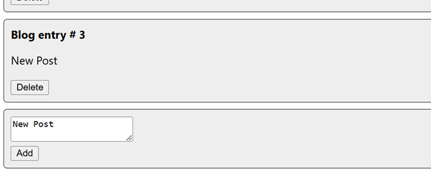

Screenshot 5: New post successfully added.

#### Mini App Summary:

In this part of the activity, we learned how to dynamically update a list and display these updates on the page. For example, we learned how to dynamically add new blog posts as well as deleting them, which took effect on the page upon clicking the add or delete buttons.

### Part 5:

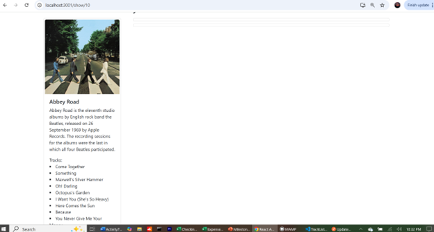

Screenshot 1: The details view for each album now displays a list of tracks.

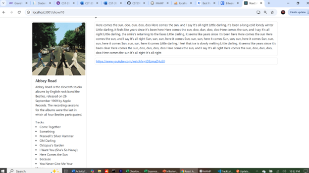

Screenshot 2: Upon selecting a track from the track list, the lyrics and video for the track are displayed.

#### Part 5 Summary:

For this part of the activity we implemented some more details for the Album Details page. This included several new components, such as 

Screenshot 2: Placeholder text showing where a future 'Add New Album' form will be located.<TrackList />```, ```<TrackTitle />```, ```<TrackLyrics />``` and ```<TrackVideo />```

### Part 6:

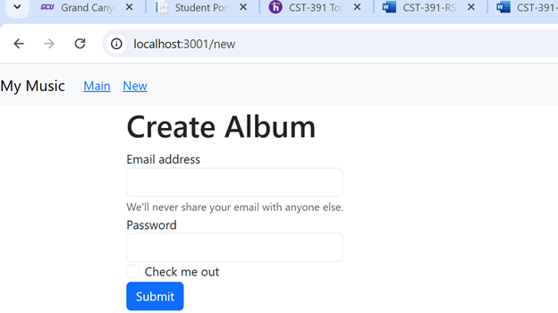

Screenshot 1: A newly added Create Album page, allowing you to enter details for a new album to be added to the database/display. Currently it still contains the code copied from bootstrap, but will be updated with relevant fields to enter all necessary information.

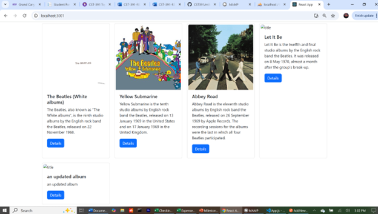

Screenshot 2: Screenshot prior to adding a new album.

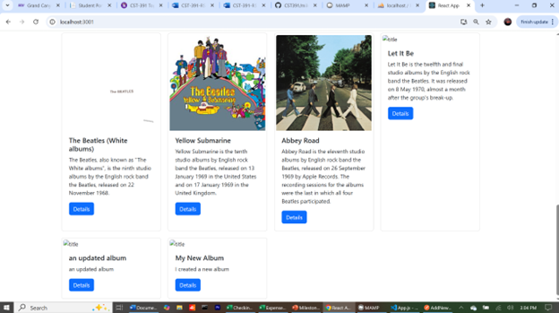

Screenshot 3: Screenshot after adding a new album.

#### Part 6 Summary:

In this part of the activity, we implemented the Create Album component. We gathered all of the necessary information from the user via a form, and posted it to the ```/albums``` endpoint in order to add it to the database. This was similar to the blog post mini app in the sense that we are implementing dynamic updates to the page.

### Part 7:
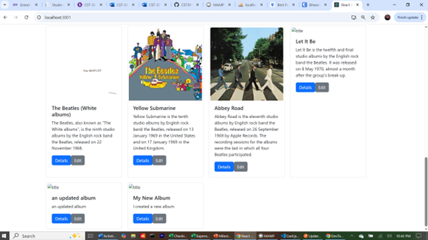

Screenshot 1: A new Edit button is displayed on each of the album cards.

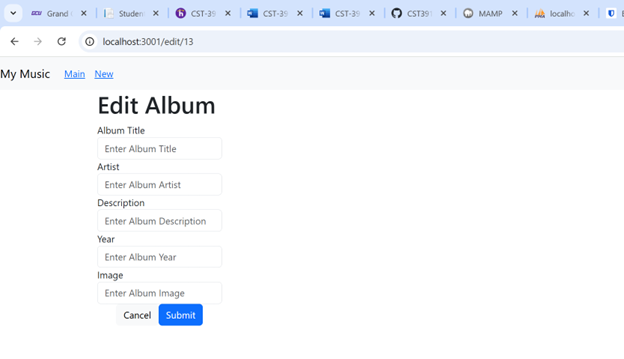

Screenshot 2: ```<EditAlbum />``` component displayed when accesing via an Edit button.

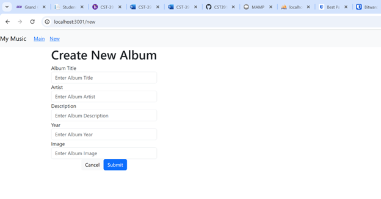

Screenshot 3: ```<EditAlbum />``` component displayed when accesing via an the New tab at the top of the page. The ```<EditAlbum />``` component is used for both adding and editing. The title displyed depends on whether you are in Edit mode or not which is determined based on the presence or absence of an existing album passed in via props.

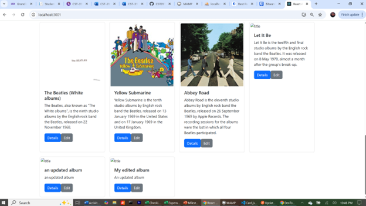

Screenshot 4: Result after clicking the edit button on the last card in the list and updating its information. This is then saved to the database and displayed back to the user on the page.

#### Part 7 Summary:

In this part of the activity, we refactored the NewAlbum component and renamed it to EditAlbum. We kept most of the code as before, but added some logic to determine whether we were attempting to edit an existing album or create a new one (this refactored component handles both cases). 

## Conclusion

- In this activity, we worked with dynamic content updates, which were introduced in the blog post mini app. We implemented a similar concept in Part 6, dynamically adding new albums to the display. We also developed some new components in order to add some additional functionality to the music application, specifically, the Album Details page. We developed a TrackList component, which held a list of TrackTitle's. Upon selecting a track, the rest of the details updated to show the lyrics and video based on the user's selection. The last part involved refactoring the NewAlbum component to include the ability to edit existing albums.