# Milestone 1
### CST 391: JavaScript Web Application Development
### Emma Gostling
 
#### Introduction: 
For this project I will be creating a “Quote Collector” application. This will be a multi-user application which allows users to gather, manage, search, and display their own collection of quotes (famous or otherwise). Users will be able to organize their collection by author, tags, and other criteria. Search functions will allow searching by words and phrases. 

#### Functionality Requirements:
-	As a new user, I want to sign up so that I can access other functionality. 
-	As a returning user, I want to log in so that I can access my collection. 
-	As a user, I want view all of my saved quotes so that I can remind myself of what I have already added.
-	As a user, I want to add new quotes to my collection so that I can view them later.
-	As a user, I want add comments to a quote so that I can reflect on why it stands out to me.
-	As a user, I want search my collection so that I can find quotes that match what I am looking for.
-	As a user, I want to edit my comments on a quote so that I can track my developing perspective over time.
-	As a user, I want update the tags associated with my comments so that find them more efficiently. 
-	As a user, I want delete old quotes that I am no longer interested in so that I can keep my collection uncluttered. 

#### ER Diagram:
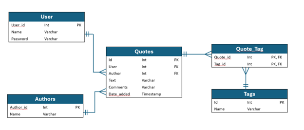

This is the initial proposed ER diagram for the application. It includes User (the application user), Authors (the source of the quote), Quotes (the text, comments and associated data of the quote itself), Tags (a collection of categories that can be associated with a quote), and a Quote_Tag join table, associating each quote with any applica

#### Sitemap:
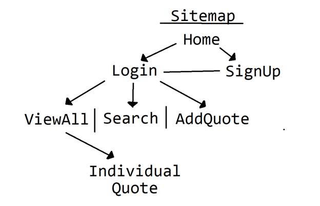

#### Wireframes:
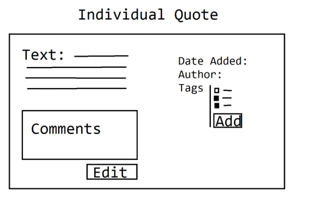
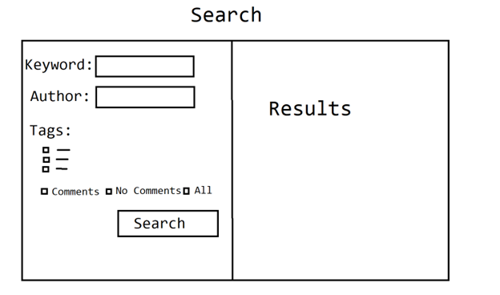
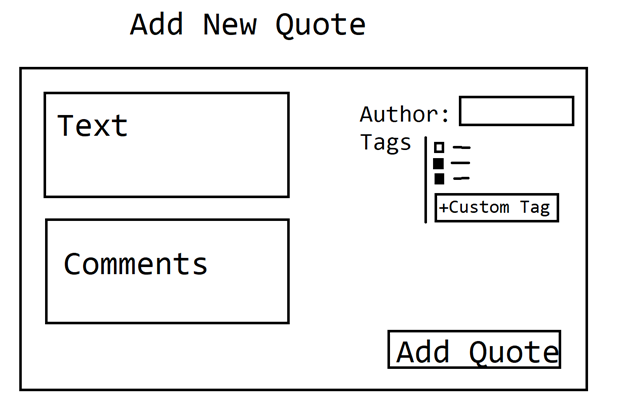
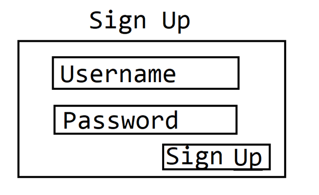
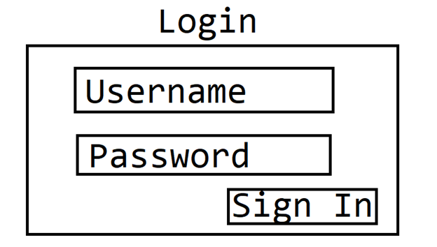

#### UML Diagrams:
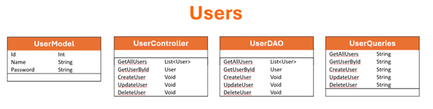
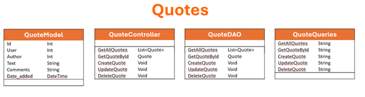
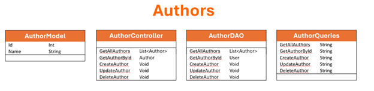
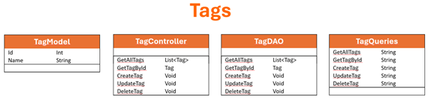

#### Risks: 
-	Undiscovered design flaws
-	Scope creep: adding additional functionality that was not originally intended to be part of the project
-	Underestimation of project size
-	Performance issues when accommodating larger numbers of users
-	Undetected bugs

