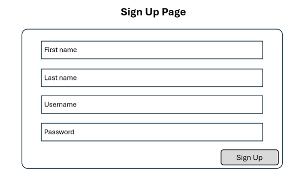

# Milestone 2
- Author:  Emma Gostling
- Date:  16 March 2025

## Instructor Feedback

<br />

Instructor Feedback left on the previous Milestone submission. 

## Addressing Instructor Feedback
The feedback left primarily focused on formatting rather than any actual content. To address the formatting, I re-created my images digitally and replaced the hand-drawn images that were used in the original submission. I also added explanations to each of my images. As far as refining the content, I made some minor changes such as updating the columns in some of the database tables to more clearly and effectively represent the entities intended, and updated the UML diagrams and wireframes to reflect these changes.

## Introduction

For this project I will be creating a “Quote Collector” application. This will be a multi-user application which allows users to gather, manage, search, and display their own collection of quotes (famous or otherwise). Users will be able to organize their collection by author, tags, and other criteria. Search functions will allow searching by words and phrases. 

## Functionality Requirements:
-	As a new user, I want to sign up so that I can access other functionality. 
-	As a returning user, I want to log in so that I can access my collection. 
-	As a user, I want view all of my saved quotes so that I can remind myself of what I have already added.
-	As a user, I want to add new quotes to my collection so that I can view them later.
-	As a user, I want add comments to a quote so that I can reflect on why it stands out to me.
-	As a user, I want search my collection so that I can find quotes that match what I am looking for.
-	As a user, I want to edit my comments on a quote so that I can track my developing perspective over time.
-	As a user, I want update the tags associated with my quotes so that find them more efficiently. 
-	As a user, I want delete old quotes that I am no longer interested in so that I can keep my collection uncluttered. 

Changes: Some minor re-wording was done in order to make the user stories more clear.


## ER Diagram:

<br />

Updated ER diagram proposed for the application. Updates include:
- Splitting the Name field int the Users table into First_name and Last_name
- Adding a Username field to the Users table
- Updating all ID fields to specify the entity which they are representing (User_id, Author_id, etc.)

## Sitemap:

<br />

Updated sitemap, redrawn to look more professional

## Wireframes:

<br />

Updated wireframe for the Individual Quote Page. 

Changes:
- Redrawn to look more professional
- Now includes an Exit button so the user can return to the page they are viewing the quote from (ViewAll, Search, etc.)


<br />

Updated wireframe for the Search Page. 

Changes:
- Redrawn to look more professional
- Minor re-arrangement of the page to make it more visually appealing
- Added an "All" checkbox to view all quotes rather than specifying comments or no comments (this will be the default anyway, but makes it easier and less confusing for the user)
<br />


<br />

Updated wireframe for the Add New Quote Page. 

Changes:
- Redrawn to look more professional
<br />


<br />

Updated wireframe for the Sign Up Page. 

Changes:
- Redrawn to look more professional
- Updated the fields to match the User table in the database
    - Split "Name" field into "First name" and "Last name"
    - Added a "Username" field


<br />
Updated wireframe for the Login Page. 

Changes:
- Redrawn to look more professional

## UML Diagrams:

<br />

Updated UML diagrams for the Users module. 

Changes:
- Redrawn to look more professional
- Updated the fields in the UserModel class to match the User table in the database
    - Split "Name" field into "First name" and "Last name"
    - Added a "Username" field


<br />

Updated UML diagrams for the Quotes module. 

Changes:
- Redrawn to look more professional


<br />

Updated UML diagrams for the Authors module. 

Changes:
- Redrawn to look more professional
- Updated the fields in the AuthorModel class to match the Author table in the database
    - Split "Name" field into "First name" and "Last name"


<br />

Updated UML diagrams for the Tags module. 

Changes:
- Redrawn to look more professional


## Risks: 
-	Undiscovered design flaws
-	Scope creep: adding additional functionality that was not originally intended to be part of the project
-	Underestimation of project size
-	Performance issues when accommodating larger numbers of users
-	Undetected bugs

## REST Endpoints

- The Endpoints used in this application include:

|Method|Endpoint|Description|
|--|--|--|
|GET|quotes|Retrieve a list of all quotes|
|GET|quotes/:id|Retrieve a specific quote|
|POST|quotes|Add a new quote to the database|
|PUT|quotes/:id|Update an existing quote|
|DELETE|quotes/:id|Delete the specified quote|

## API Example API Requests

```json
  GET /quotes
  Response:
  [
    {
      "Quote_id": 26,
      "User_id": 43,
      "Author_id": 15,
      "Text": "When life gives you lemons, make lemonade.",
      "Comments": "I like this quote because...",
      "Date_added": "15-MAR-2025"
    },
    {
      "Quote_id": 14,
      "User_id": 19,
      "Author_id": 27,
      "Text": "When you get the choice to sit it out or dance...I hope you dance!",
      "Comments": "I like this quote because...",
      "Date_added": "11-FEB-2025"
    }
  ]
```

## Conclusion

- For this milestone we updated the project proposal to improve each section and address any feedback given by the instructor. We also introduced a design for the API that our project will include, as well as providing an example response from one of the API endpoints.
