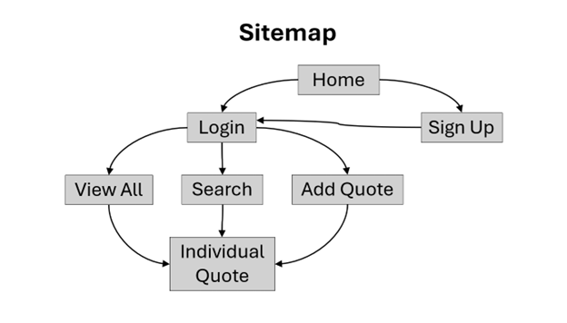
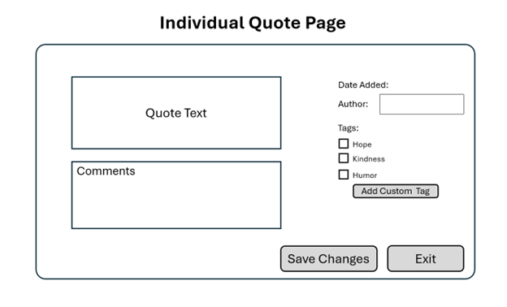
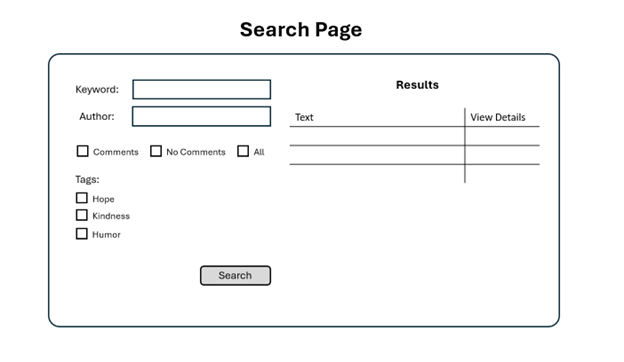
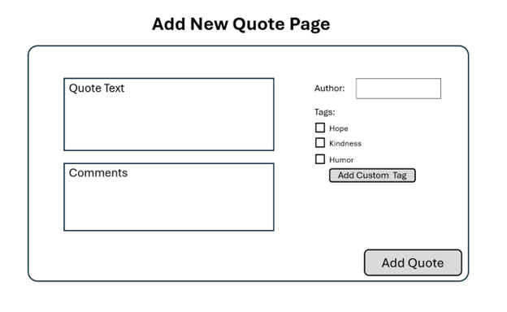
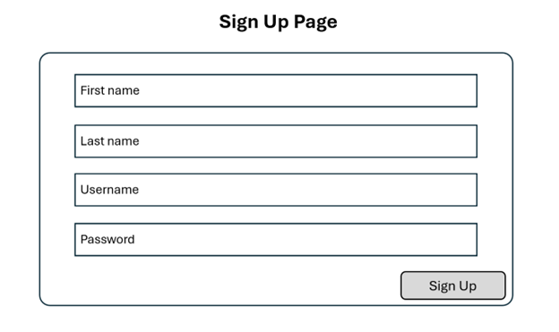
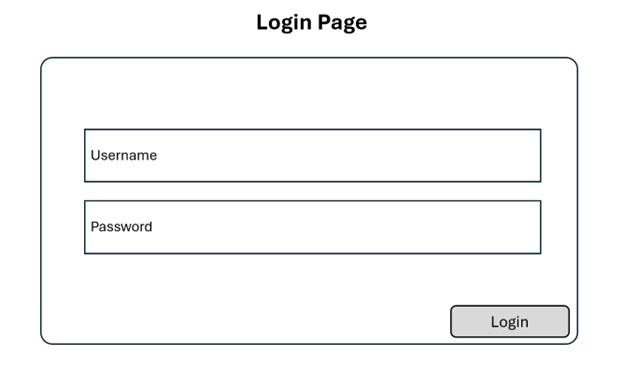
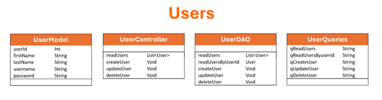
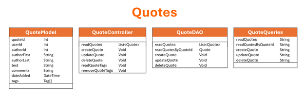
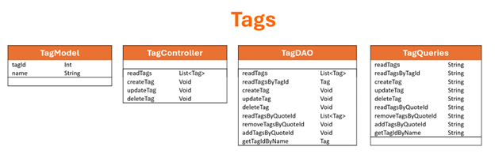

# Milestone 3
- Author:  Emma Gostling
- Date:  16 March 2025

## Overview

In this milestone, we created a MySQL database and implemented the initial API for the project. This included controller, model, DAO, route and query classes for each module. The project was built using Typescript and Express/NodeJS.

## Design Updates

- updated quote model to include additional properties:
  - authorFirst
  - authorLast
  - tags
- added some additional helper functions to the QuoteController class
  - <b>readQuoteTags:</b> adds any tags associated with a qiven quote
  - <b>removeQuoteTags:</b> removes any tags that are no longer associated with a given quote
- added an additional query to the AuthorDAO and AuthorQueries classes
  - <b>getAuthorIdByName:</b> finds the id of an author given the author's name
- added additional queries the TagDAO and TagQueries classes
  - <b>readTagsByQuoteId:</b> gets a list of all tags associated with a given quote
  - <b>removeTagsByQuoteId:</b> removes a tag from a given quote
  - <b>addTagsByQuoteId:</b> adds a tag to a given quote
  - <b>getTagIdByName:</b> finds the id of a tag given a tag name

## Screencast Link

 Watch the screencast here: [Milestone3](https://youtu.be/-2LRZosMnYQ)

## Introduction

For this project I will be creating a “Quote Collector” application. This will be a multi-user application which allows users to gather, manage, search, and display their own collection of quotes (famous or otherwise). Users will be able to organize their collection by author, tags, and other criteria. Search functions will allow searching by words and phrases. 

## Functionality Requirements:
-	As a new user, I want to sign up so that I can access other functionality. 
-	As a returning user, I want to log in so that I can access my collection. 
-	As a user, I want view all of my saved quotes so that I can remind myself of what I have already added.
-	As a user, I want to add new quotes to my collection so that I can view them later.
-	As a user, I want add comments to a quote so that I can reflect on why it stands out to me.
-	As a user, I want search my collection so that I can find quotes that match what I am looking for.
-	As a user, I want to edit my comments on a quote so that I can track my developing perspective over time.
-	As a user, I want update the tags associated with my quotes so that find them more efficiently. 
-	As a user, I want delete old quotes that I am no longer interested in so that I can keep my collection uncluttered. 

## ER Diagram:

<br />

Current ER diagram for the application. 

## Sitemap:

<br />

Current sitemap for the application

## Wireframes:

<br />

Current wireframe for the Individual Quote Page. 


<br />

Current wireframe for the Search Page. 


<br />

Current wireframe for the Add New Quote Page. 


<br />

Current wireframe for the Sign Up Page. 


<br />

Current wireframe for the Login Page. 

## UML Diagrams:

<br />

Updated UML diagrams for the Users module. 


<br />

Updated UML diagrams for the Quotes module. 


<br />

Updated UML diagrams for the Authors module. 


<br />

Updated UML diagrams for the Tags module. 

## Risks: 
-	Undiscovered design flaws
-	Scope creep: adding additional functionality that was not originally intended to be part of the project
-	Underestimation of project size
-	Performance issues when accommodating larger numbers of users
-	Undetected bugs

## REST Endpoints

- The Endpoints used in this application include:

|Method|Endpoint|Description|
|--|--|--|
|GET|quotes|Retrieve a list of all quotes|
|GET|quotes/:id|Retrieve a specific quote|
|POST|quotes|Add a new quote to the database|
|PUT|quotes/:id|Update an existing quote|
|DELETE|quotes/:id|Delete the specified quote|
|GET|authors|Retrieve a list of all authors|
|GET|tags|Retrieve a list of all tags|

## API Example API Requests

```json
  GET /quotes
  Response:
  [
    {
      "Quote_id": 26,
      "User_id": 43,
      "Author_id": 15,
      "Text": "When life gives you lemons, make lemonade.",
      "Comments": "I like this quote because...",
      "Date_added": "15-MAR-2025"
    },
    {
      "Quote_id": 14,
      "User_id": 19,
      "Author_id": 27,
      "Text": "When you get the choice to sit it out or dance...I hope you dance!",
      "Comments": "I like this quote because...",
      "Date_added": "11-FEB-2025"
    }
  ]
```
## Challenges, Bugs and Lessons Learned

<b>Challenges:</b> One challenge for this milestone was figuring out how to debug a typescript application, and why the code was not stopping at my breakpoints. The solution involed running the "tsc" command and running the program in debug mode.

<b>Bugs:</b> No known bugs at the current time. One of the most difficult bugs to figure out from this milestone was accessing the data that was returned from the database. In the end it had to do with the fact that the column names returned from the database were slightly different compared to the associated properties in the model class.

<b>Lessons Learned:</b>By completing this milestone, I became more familiar with typescript applications and how they are structured, as well as how to define API endpoints via the routes class for a given module.

## Conclusion

- For this milestone we implemented the proposed API endpoints and used Postman to test them. We also provided a screencast to demonstrate the functionality of these endpoints.
