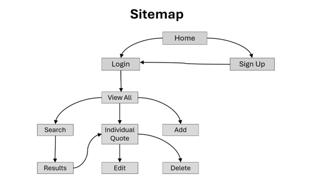
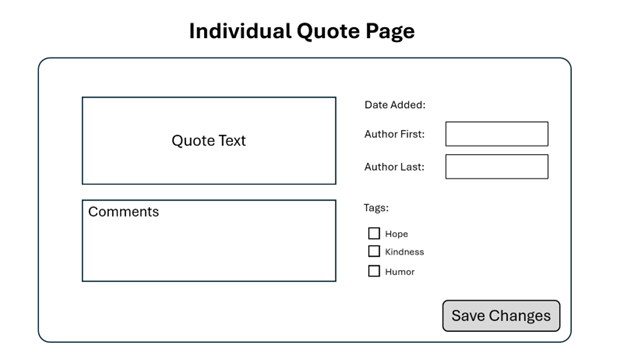
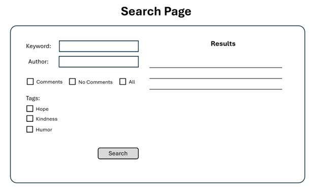
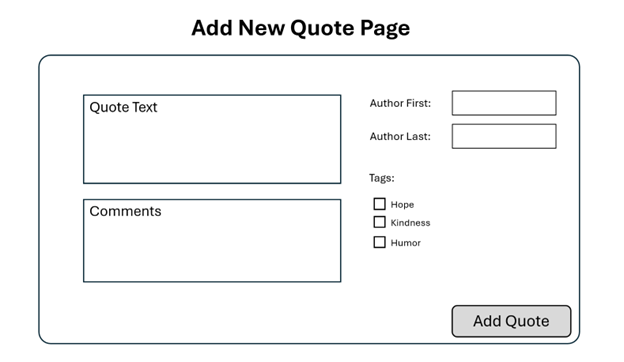
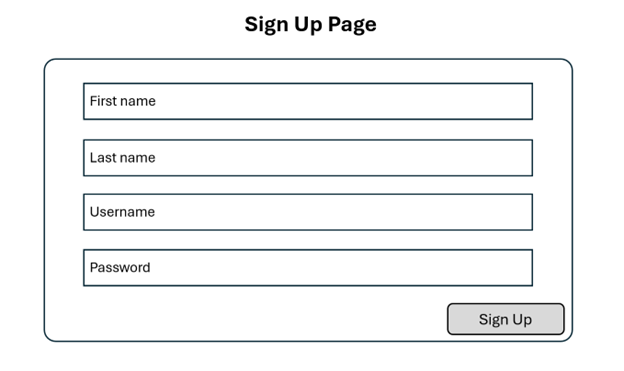
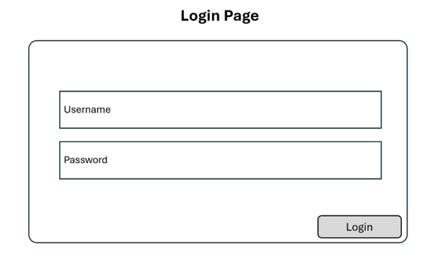
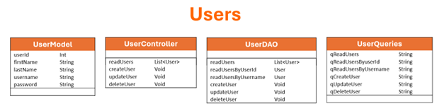
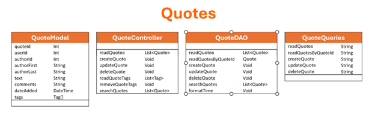
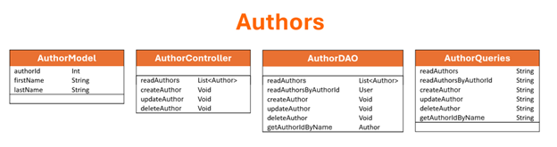

# Milestone 4
- Author:  Emma Gostling
- Date:  30 March 2025

## Overview

In this milestone, we implemented a front end to our proposed application using Angular. This included implementing each of the wireframes and functionality described in the design report.

## Design Updates

- updated UserDAO and UserQueries to provide support for login:
  - <b>readUsersByUsername:</b> searches for a user in the database given the username
- updated QuoteController to support search functionality:
  - <b>searchQuotes:</b> calls the DAO to search the database for quotes matching the specified criteria
- updated QuoteDAO:
  - <b>searchQuotes:</b> searches the database for quotes matching the specified criteria
  - <b>formatTime:</b> ensures that the timestamp passed in adheres to the required format prior to adding or updating a quote in the database
- updated the SiteMap to reflect the current navigation flow
- updated the API to include a ```POST quotes/search``` endpoint to support search functionality


## Screencast Link

 Watch the screencast here: [Milestone4](https://youtu.be/9MXhETI8owE)

## Introduction

For this project I will be creating a “Quote Collector” application. This will be a multi-user application which allows users to gather, manage, search, and display their own collection of quotes (famous or otherwise). Users will be able to organize their collection by author, tags, and other criteria. Search functions will allow searching by words and phrases. 

## Functionality Requirements:
-	As a new user, I want to sign up so that I can access other functionality. 
-	As a returning user, I want to log in so that I can access my collection. 
-	As a user, I want view all of my saved quotes so that I can remind myself of what I have already added.
-	As a user, I want to add new quotes to my collection so that I can view them later.
-	As a user, I want add comments to a quote so that I can reflect on why it stands out to me.
-	As a user, I want search my collection so that I can find quotes that match what I am looking for.
-	As a user, I want to edit my comments on a quote so that I can track my developing perspective over time.
-	As a user, I want update the tags associated with my quotes so that find them more efficiently. 
-	As a user, I want delete old quotes that I am no longer interested in so that I can keep my collection uncluttered. 

## ER Diagram:

<br />

Current ER diagram for the application. 

## Sitemap:

<br />

Current sitemap for the application

## Wireframes:

<br />

Current wireframe for the Individual Quote Page. 


<br />

Current wireframe for the Search Page. 


<br />

Current wireframe for the Add New Quote Page. 


<br />

Current wireframe for the Sign Up Page. 


<br />

Current wireframe for the Login Page. 

## UML Diagrams:

<br />

Updated UML diagrams for the Users module. 


<br />

Updated UML diagrams for the Quotes module. 


<br />

Updated UML diagrams for the Authors module. 


<br />

Updated UML diagrams for the Tags module. 

## Risks: 
-	Undiscovered design flaws
-	Scope creep: adding additional functionality that was not originally intended to be part of the project
-	Underestimation of project size
-	Performance issues when accommodating larger numbers of users
-	Undetected bugs

## REST Endpoints

- The Endpoints used in this application include:

|Method|Endpoint|Description|
|--|--|--|
|GET|quotes|Retrieve a list of all quotes|
|GET|quotes/:id|Retrieve a specific quote|
|POST|quotes|Add a new quote to the database|
|PUT|quotes/:id|Update an existing quote|
|DELETE|quotes/:id|Delete the specified quote|
|GET|authors|Retrieve a list of all authors|
|GET|tags|Retrieve a list of all tags|
|POST|quotes/search|Retrieve a list of quotes matching the specified criteria|

## API Example API Requests

```json
  GET /quotes
  Response:
  [
    {
      "Quote_id": 26,
      "User_id": 43,
      "Author_id": 15,
      "Text": "When life gives you lemons, make lemonade.",
      "Comments": "I like this quote because...",
      "Date_added": "15-MAR-2025"
    },
    {
      "Quote_id": 14,
      "User_id": 19,
      "Author_id": 27,
      "Text": "When you get the choice to sit it out or dance...I hope you dance!",
      "Comments": "I like this quote because...",
      "Date_added": "11-FEB-2025"
    }
  ]
```
## Challenges, Bugs and Lessons Learned

<b>Challenges:</b> One of the biggest challenges for this milestone was figuring out how to navigate back up the chain from a child module to a parent module (for example, how to get back to the individual quote view after saving changes in edit mode without having to reselect it from the list). The solution involved an ```@Output``` EventEmitter variable which sent an event back to the parent to reset the ```editMode``` variable to false so that the individual quote page could be displayed again.

<b>Bugs:</b> No known bugs at the current time. One challenging bug from this milestone was getting the logic correct for the search functionality. I had some nested for-loops, and was getting my variable confused.

<b>Lessons Learned:</b>By completing this milestone, I gained some understanding of Angular applications and how the various modules work together in order to form a working application.

## Conclusion

- For this milestone we implemented the proposed project with Angular to create the front end for the API defined previously and added in all of the functionality for the user stories. We also provided a screencast to demonstrate the working product.
