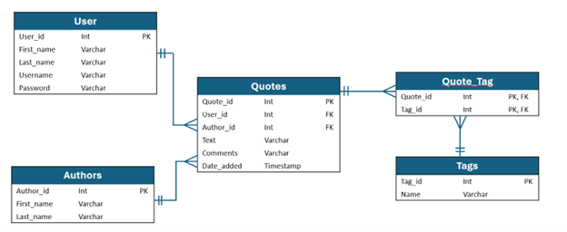
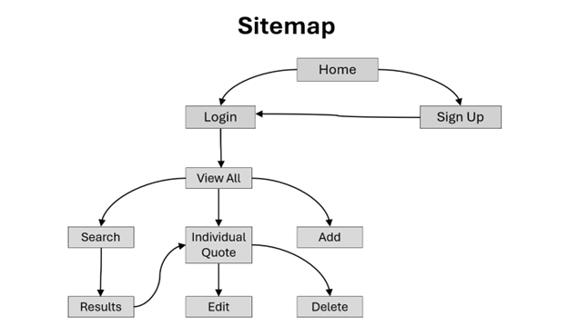
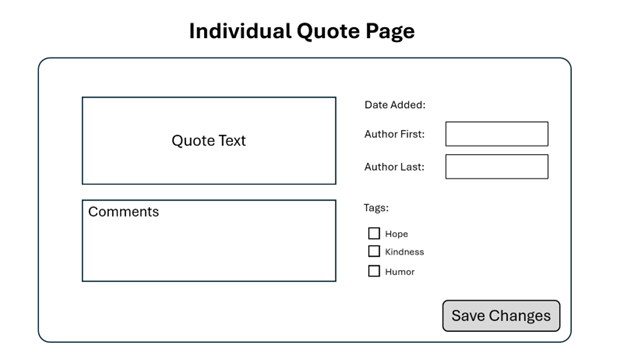
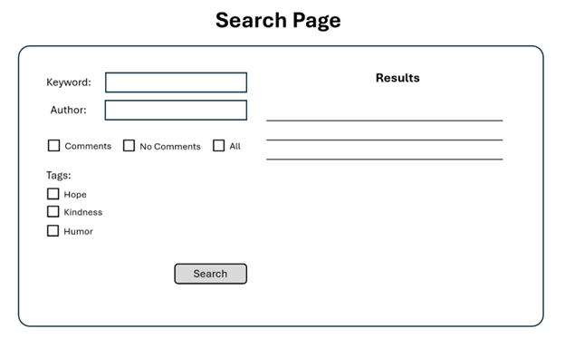
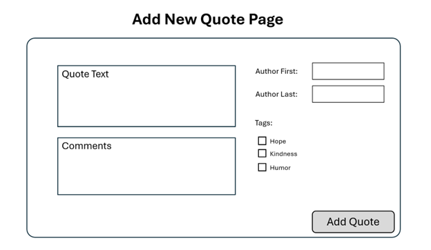
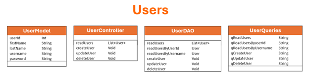
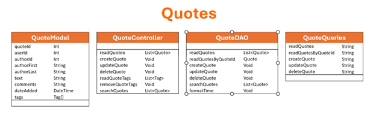
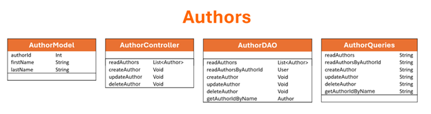
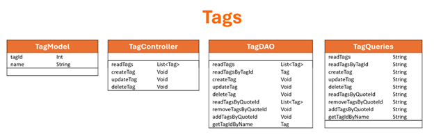

# Milestone 5
- Author:  Emma Gostling
- Date:  20 April 2025

## Overview

In this milestone, we implemented a front end to our proposed application using React. This included implementing each of the wireframes and functionality described in the design report.

## Design Updates

- Current design is the same as Milestone 4, but is implemented using React rather than Angular

- Add and Edit now use the same component, which includes some logic to determine which role it is serving in the current context.

## Screencast Link

 Watch the screencast here: [Milestone5](https://youtu.be/p0DFcq1HG3Y)

## Introduction

For this project I will be creating a “Quote Collector” application. This will be a multi-user application which allows users to gather, manage, search, and display their own collection of quotes (famous or otherwise). Users will be able to organize their collection by author, tags, and other criteria. Search functions will allow searching by words and phrases. 

## Functionality Requirements:
-	As a new user, I want to sign up so that I can access other functionality. 
-	As a returning user, I want to log in so that I can access my collection. 
-	As a user, I want view all of my saved quotes so that I can remind myself of what I have already added.
-	As a user, I want to add new quotes to my collection so that I can view them later.
-	As a user, I want add comments to a quote so that I can reflect on why it stands out to me.
-	As a user, I want search my collection so that I can find quotes that match what I am looking for.
-	As a user, I want to edit my comments on a quote so that I can track my developing perspective over time.
-	As a user, I want update the tags associated with my quotes so that find them more efficiently. 
-	As a user, I want delete old quotes that I am no longer interested in so that I can keep my collection uncluttered. 

## ER Diagram:

<br />

Current ER diagram for the application. 

## Sitemap:

<br />

Current sitemap for the application

## Wireframes:

<br />

Current wireframe for the Individual Quote Page. 


<br />

Current wireframe for the Search Page. 


<br />

Current wireframe for the Add New Quote Page. 


<br />

Current wireframe for the Sign Up Page. 


<br />

Current wireframe for the Login Page. 

## UML Diagrams:

<br />

Updated UML diagrams for the Users module. 


<br />

Updated UML diagrams for the Quotes module. 


<br />

Updated UML diagrams for the Authors module. 


<br />

Updated UML diagrams for the Tags module. 

## Risks: 
-	Undiscovered design flaws
-	Scope creep: adding additional functionality that was not originally intended to be part of the project
-	Underestimation of project size
-	Performance issues when accommodating larger numbers of users
-	Undetected bugs

## REST Endpoints

- The Endpoints used in this application include:

|Method|Endpoint|Description|
|--|--|--|
|GET|quotes|Retrieve a list of all quotes|
|GET|quotes/:id|Retrieve a specific quote|
|POST|quotes|Add a new quote to the database|
|PUT|quotes/:id|Update an existing quote|
|DELETE|quotes/:id|Delete the specified quote|
|GET|authors|Retrieve a list of all authors|
|GET|tags|Retrieve a list of all tags|
|POST|quotes/search|Retrieve a list of quotes matching the specified criteria|

## API Example API Requests

```json
  GET /quotes
  Response:
  [
    {
      "Quote_id": 26,
      "User_id": 43,
      "Author_id": 15,
      "Text": "When life gives you lemons, make lemonade.",
      "Comments": "I like this quote because...",
      "Date_added": "15-MAR-2025"
    },
    {
      "Quote_id": 14,
      "User_id": 19,
      "Author_id": 27,
      "Text": "When you get the choice to sit it out or dance...I hope you dance!",
      "Comments": "I like this quote because...",
      "Date_added": "11-FEB-2025"
    }
  ]
```
## Challenges, Bugs and Lessons Learned

<b>Challenges:</b> As with the previous milestone, the biggest challenge for this milestone was navigation, and figuring out how to pass all of the necesary data and props into the appropriate components in order to display and interact with them as needed. Paying attention to how each component was being initialized and from where was important when it came to debugging the application.

<b>Bugs:</b> One minor bug is that when returning to the search page after clicking the 'Back' button on an individual quote, it does not reload the previous search results, but simply goes back to the initial search page. As it stands currently, the user would have to re-enter their search. In the end I decided this was okay since it was not listed among the user stories defined in the project documentation. This is simply an additional feature to develop at a later time.

<b>Lessons Learned:</b> By completing this milestone, I became more familiar with react applications and how to use state variables and props. I also learned a lot about navigation within a React application.

## Conclusion

- For this milestone we implemented the proposed project with React to create the front end for the API, providing all of the functionality defined in the user stories. We also provided a screencast to demonstrate the working product.
